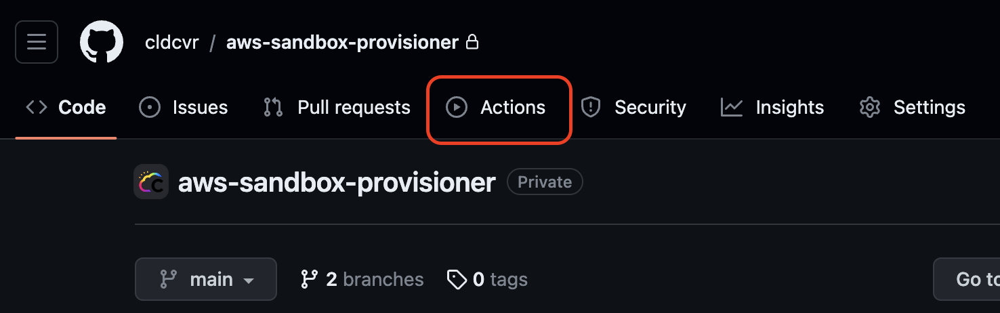
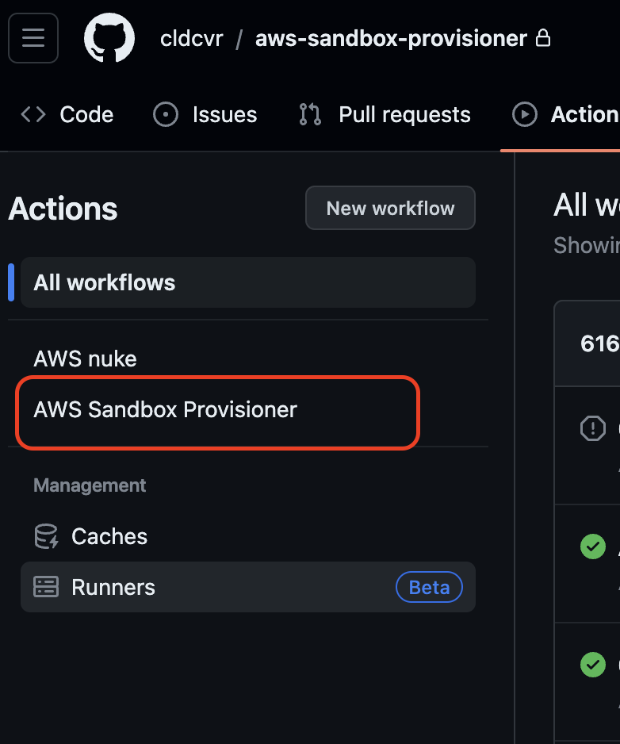
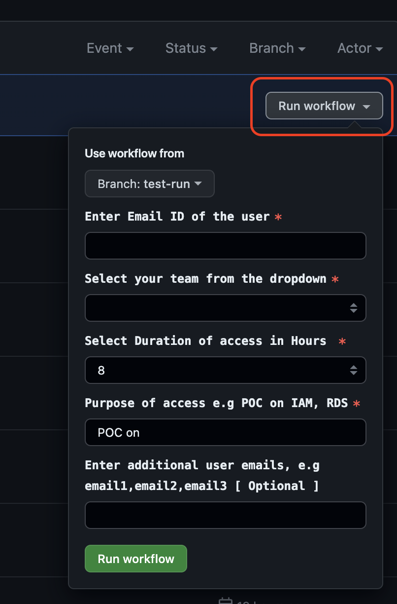
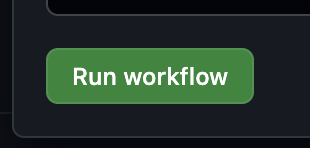

# AWS Sandbox Provisioner Usage and workflow details

This tool consists of two primary workflows
1. [Account Provisioning](#account-provisioning)
- [Provisioning Workflow Details](#provisioning-steps)

2. [Account Cleanup (Nuke)](#account-cleanup-nuke)
- [Cleanup Workflow Details](#nuke-steps)

## Account Provisioning

The account provisioning can be used to provision sandbox accounts

1. Open Sandbox Provisioner GitHub repository.
2. Head over to the Actions tab

   

3. Select the AWS Sandbox Provisioner workflow

   

4. Click on Run workflow and fill in the required input parameters: `EMAIL`, `TEAM`, `DURATION`, `PURPOSE` and `Additional User Emails` [Optional]

   

5. Click Run workflow

   

# Detailed Workflow Steps

## Provisioning Steps
Find below the workflow steps that are involved during provisioning a Sandbox Account to a user.

## Nuke Steps
Find below the workflow steps that are involved during cleaning, aka Nuke and access revoke to Sandbox Account to a user.

#